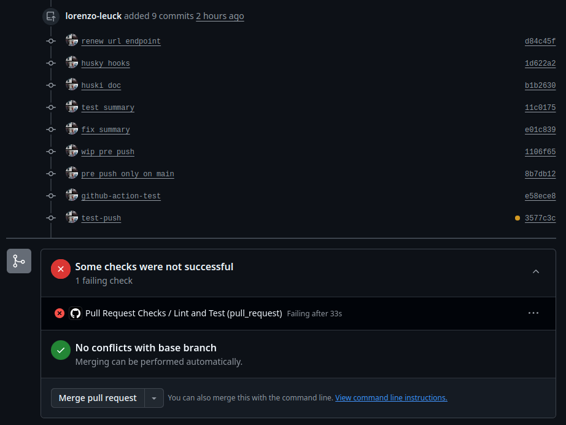

# Backend Test
URL shortening system


[circleci-image]: https://img.shields.io/circleci/build/github/nestjs/nest/master?token=abc123def456
[circleci-url]: https://circleci.com/gh/nestjs/nest


</p>


## Candidate: 
<a href="https://www.linkedin.com/in/lorenzo-leuck/">Lorenzo Leuck</a>


# Project setup

## Requirements

- [Docker](https://www.docker.com/get-started) (version 20.10.0 or higher with Docker Compose V2)
- [Node.js](https://nodejs.org/) (version 20.x)
- [npm](https://www.npmjs.com/) (version 9.x or higher)

## Run app

```bash
# Clone the repository
git clone https://github.com/lorenzo-leuck/teste-backend.git

# Navigate to project directory
cd teste-backend

# Configure environment variables
cp .env.example .env

# Edit the .env file to configure your environment variables

# Start the Docker containers using npm script
npm run docker:up

# The application will be available at http://localhost:3000
# PostgreSQL will be available at localhost:5433
# PgAdmin will be available at http://localhost:5050 (login: admin@admin.com / password: admin)
```

## Run tests

```bash
# Run unit tests
npm run test

# Run tests with coverage
npm run test:cov

# Run end-to-end tests
npm run test:e2e
```

# Deployment


```bash

```

# Resources
The application is containerized using Docker and orchestrated with Docker Compose. The setup includes:

- **NestJS Application**: The main application container running the API
- **PostgreSQL Database**: Relational database for storing URL data and user information
- **PgAdmin**: Web-based PostgreSQL administration tool

## Authentication

The application uses JWT (JSON Web Token) based authentication with Bearer tokens. Authentication is required for certain endpoints, while others can be accessed without authentication.

### Authentication Endpoints

- **POST /api/auth/signup**: Register a new user
  - Request body: `{ "username": "string", "email": "string", "password": "string" }`
  - Response: `{ "token": "string" }`

### Protected Routes

The following routes require authentication with a valid Bearer token:

- All URL management endpoints (GET, POST, PUT, DELETE /api/urls)
- User-specific endpoints

### Authentication Headers

For protected routes, include the JWT token in the Authorization header:

```
Authorization: Bearer <your_jwt_token>
```

Alternatively, you can use the custom header format for Swagger UI testing:

```
token: <your_jwt_token>
```


  

## URL Shortening

The application provides URL shortening functionality with a 6-character limit for the shortened code. The system supports both authenticated and public URL shortening.

### Creating a Shortened URL (Authenticated)

**Endpoint:** `POST /api/urls`

**Authentication:** Required (JWT token)

To create a shortened URL as an authenticated user, include your JWT token in the request header:

```
token: <your_jwt_token>
```

**Request Body:**

```json
{
  "originalUrl": "https://www.example.com/very/long/path/to/resource"
}
```

**Response:**

```json
{
  "id": "550e8400-e29b-41d4-a716-446655440000",
  "shortCode": "Ab3x9Z",
  "originalUrl": "https://www.example.com/very/long/path/to/resource",
  "shortUrl": "http://localhost:3000/Ab3x9Z"
}
```

**Note:** When authenticated, each URL shortening operation increases the user's usage count. Users have a default limit of 10 shortened URLs, which can be adjusted in the user settings.

### Creating a Shortened URL (Public)

**Endpoint:** `POST /api/urls/public`

**Authentication:** None required

**Request Body:**

```json
{
  "originalUrl": "https://www.example.com/very/long/path/to/resource"
}
```

**Response:**

```json
{
  "id": "550e8400-e29b-41d4-a716-446655440000",
  "shortCode": "Ab3x9Z",
  "originalUrl": "https://www.example.com/very/long/path/to/resource",
  "shortUrl": "http://localhost:3000/Ab3x9Z"
}
```

### Retrieving All Shortened URLs

**Endpoint:** `GET /api/urls`

**Authentication:** None required

**Response:**

```json
[
  {
    "id": "550e8400-e29b-41d4-a716-446655440000",
    "shortCode": "Ab3x9Z",
    "originalUrl": "https://www.example.com/very/long/path/to/resource",
    "shortUrl": "http://localhost:3000/Ab3x9Z",
    "clicks": 5,
    "createdAt": "2023-07-01T12:00:00.000Z",
    "user": {
      "id": "8a8a8a8a-8a8a-8a8a-8a8a-8a8a8a8a8a8a",
      "email": "user@example.com"
    }
  }
]
```

### Retrieving User's Shortened URLs

**Endpoint:** `GET /api/urls/byUser`

**Authentication:** Required (JWT token)

**Response:**

```json
[
  {
    "id": "550e8400-e29b-41d4-a716-446655440000",
    "shortCode": "Ab3x9Z",
    "originalUrl": "https://www.example.com/very/long/path/to/resource",
    "shortUrl": "http://localhost:3000/Ab3x9Z",
    "clicks": 5,
    "createdAt": "2023-07-01T12:00:00.000Z"
  }
]
```

### Updating a Shortened URL

**Endpoint:** `PUT /api/urls/:id`

**Authentication:** Required (JWT token)

**Path Parameters:**
- `id`: The ID of the URL to update

**Request Body:**

```json
{
  "originalUrl": "https://www.example.com/updated/path/to/resource"
}
```

**Response:**

```json
{
  "id": "550e8400-e29b-41d4-a716-446655440000",
  "shortCode": "Ab3x9Z",
  "originalUrl": "https://www.example.com/updated/path/to/resource",
  "shortUrl": "http://localhost:3000/Ab3x9Z",
  "clicks": 5,
  "updatedAt": "2023-07-01T14:30:00.000Z"
}
```

**Error Responses:**

- `403 Forbidden`: If the user tries to update a URL that doesn't belong to them
- `404 Not Found`: If the URL with the specified ID doesn't exist

### Deleting a Shortened URL

**Endpoint:** `DELETE /api/urls/:id`

**Authentication:** Required (JWT token)

**Path Parameters:**
- `id`: The ID of the URL to delete

**Response:**

```json
{
  "message": "URL deleted successfully"
}
```

**Error Responses:**

- `403 Forbidden`: If the user tries to delete a URL that doesn't belong to them
- `404 Not Found`: If the URL with the specified ID doesn't exist

**Note:** This endpoint performs a soft delete, meaning the URL record is not physically removed from the database but marked as deleted and will no longer be accessible through the API.

### Deleting a User Account

**Endpoint:** `DELETE /auth/users/:id`

**Authentication:** Required (JWT token)

**Path Parameters:**
- `id`: The ID of the user account to delete

**Response:**

```json
{
  "message": "User account deleted successfully"
}
```

**Error Responses:**

- `401 Unauthorized`: If the user tries to delete an account that is not their own
- `404 Not Found`: If the user with the specified ID doesn't exist

**Note:** This endpoint performs a soft delete, meaning the user record is not physically removed from the database but marked as deleted. All associated URLs will remain in the database but will no longer be accessible.
    "shortCode": "Ab3x9Z",
    "originalUrl": "https://www.example.com/very/long/path/to/resource",
    "shortUrl": "http://localhost:3000/Ab3x9Z",
    "createdAt": "2025-06-30T23:30:00.000Z",
    "user": {
      "id": "a1b2c3d4-e5f6-4a5b-8c7d-9e0f1a2b3c4d",
      "email": "user@example.com"
    }
  },
  {
    "id": "660e8400-e29b-41d4-a716-446655440001",
    "shortCode": "Xy7z9A",
    "originalUrl": "https://www.example.com/another/path",
    "shortUrl": "http://localhost:3000/Xy7z9A",
    "createdAt": "2025-06-30T23:25:00.000Z",
    "user": null
  }
]
```

**Note:** The response includes all URLs in the system, with user information for authenticated URLs and `null` for URLs created through the public endpoint.

### Retrieving User's Shortened URLs

**Endpoint:** `GET /api/urls/byUser`

**Authentication:** Required (JWT token)

To retrieve URLs for the authenticated user, include your JWT token in the request header:

```
token: <your_jwt_token>
```

**Response:**

```json
[
  {
    "id": "550e8400-e29b-41d4-a716-446655440000",
    "shortCode": "Ab3x9Z",
    "originalUrl": "https://www.example.com/very/long/path/to/resource",
    "shortUrl": "http://localhost:3000/Ab3x9Z",
    "createdAt": "2025-06-30T23:30:00.000Z"
  },
  {
    "id": "660e8400-e29b-41d4-a716-446655440001",
    "shortCode": "Xy7z9A",
    "originalUrl": "https://www.example.com/another/path",
    "shortUrl": "http://localhost:3000/Xy7z9A",
    "createdAt": "2025-06-30T23:25:00.000Z"
  }
]
```

**Note:** This endpoint only returns URLs created by the authenticated user.

### URL Redirection

**Endpoint:** `GET /:shortCode`

**Authentication:** None required

**Description:** Redirects to the original URL associated with the provided short code.

For example, visiting `http://localhost:3000/Ab3x9Z` will redirect to the original URL associated with the short code `Ab3x9Z`.

**Response:**
- HTTP 302 Found: Redirects to the original URL
- HTTP 404 Not Found: If the short code doesn't exist or has been deleted

**Implementation Details:**
- The URL redirection is implemented at the root level, bypassing the global API prefix
- This allows shortened URLs to be accessed directly through the base domain
- The redirection controller handles all requests matching the pattern `/:shortCode`
- Each redirection increments the click count for the URL
- Click statistics are included in URL responses


## Tests

The application includes comprehensive test coverage for all major functionality. Tests are written using Jest and the NestJS testing utilities.

### Authentication Flow

To test the complete authentication flow, run:

```bash
npm run test:e2e -- test/auth-flow.e2e-spec.ts
```

This test verifies:
1. Public endpoint access
2. Protected endpoint rejection without token
3. User registration
4. User signin
5. Protected endpoint access with valid token

### Running Tests

```bash
# Run all tests
npm test

# Run specific test files
npm test -- src/modules/url/url.service.spec.ts
npm test -- src/modules/auth/auth.service.spec.ts
npm test -- src/modules/url/url.controller.spec.ts
npm test -- src/modules/auth/auth.controller.spec.ts

# Run tests with coverage report
npm test -- --coverage
```

### Test Coverage

The test suite covers:

- URL service methods including soft delete functionality
- Authentication service methods including user management and soft delete
- URL controller endpoints including CRUD operations
- Authentication controller endpoints including user registration and deletion
- Middleware functionality for URL redirection and click tracking

## Cloud Deployment

This project includes configurations for deploying to a Kubernetes cluster on AWS using Terraform.

### Prerequisites

- [Terraform](https://www.terraform.io/downloads.html) (version 1.0.0 or higher)
- [AWS CLI](https://aws.amazon.com/cli/) configured with appropriate credentials
- [kubectl](https://kubernetes.io/docs/tasks/tools/install-kubectl/) for interacting with the Kubernetes cluster

### Deployment Steps

#### 1. Initialize Terraform

```bash
cd terraform
terraform init
```

#### 2. Configure Variables

Create a `terraform.tfvars` file with your specific values:

```
aws_region   = "us-east-1"
cluster_name = "url-shortener"
db_name      = "urlshortener"
db_username  = "postgres"
db_password  = "your-secure-password"
```

#### 3. Deploy Infrastructure

```bash
terraform plan
terraform apply
```

This will create:
- An EKS cluster on AWS
- A VPC with public and private subnets
- A PostgreSQL RDS instance
- An ECR repository for Docker images

#### 4. Configure kubectl

After the infrastructure is deployed, configure kubectl to connect to your EKS cluster:

```bash
aws eks update-kubeconfig --region us-east-1 --name url-shortener
```

#### 5. Build and Push Docker Image

```bash
# Get the ECR repository URL
export ECR_REPO=$(terraform output -raw ecr_repository_url)

# Authenticate Docker to ECR
aws ecr get-login-password --region us-east-1 | docker login --username AWS --password-stdin $ECR_REPO

# Build and tag the Docker image
docker build -t url-shortener-api .
docker tag url-shortener-api:latest $ECR_REPO:latest

# Push the image to ECR
docker push $ECR_REPO:latest
```

#### 6. Update Kubernetes Manifests

Replace `${DOCKER_REGISTRY}` in the deployment.yaml file with your ECR repository URL:

```bash
sed -i "s|\${DOCKER_REGISTRY}|$ECR_REPO|g" k8s/deployment.yaml
```

#### 7. Create Kubernetes Resources

```bash
# Apply secrets first
kubectl apply -f k8s/secrets.yaml

# Apply other resources
kubectl apply -f k8s/configmap.yaml
kubectl apply -f k8s/deployment.yaml
kubectl apply -f k8s/service.yaml
kubectl apply -f k8s/ingress.yaml
```

#### 8. Verify Deployment

```bash
kubectl get pods
kubectl get services
kubectl get ingress
```

#### 9. Access the Application

Once the ingress is properly configured and DNS records are updated, you can access your application at:

```
https://shorturl.example.com
```

### Cleanup

To destroy all resources created by Terraform:

```bash
terraform destroy
```

Note: This will remove all resources including the database. Make sure to backup any important data before running this command.

## Observability

The application includes built-in observability features that can be enabled via environment variables:

- **Logging**: Configurable logging to console and/or files
- **Request Tracking**: Monitor HTTP requests, response times, and status codes
- **Performance Monitoring**: Track endpoint performance with sampling
- **Health Checks**: Access system status via the `/health` endpoint

To enable observability features, set the following in your `.env` file:

```
OBSERVABILITY_ENABLED=true
```

Additional configuration options:

```
LOG_LEVEL=info           # Options: error, warn, info, debug, verbose
LOG_TO_FILE=true         # Enable file-based logging
TRACK_REQUESTS=true      # Track HTTP requests
MONITOR_PERFORMANCE=true # Monitor endpoint performance
ENABLE_HEALTH_CHECKS=true # Enable /health endpoint
```

### Datadog Integration

The application supports sending logs and metrics to Datadog when configured with the appropriate environment variables:

```
DATADOG_ENABLED=true     # Enable Datadog integration
DATADOG_API_KEY=your_api_key  # Your Datadog API key
DATADOG_HOST=your_hostname    # Optional: Host identifier in Datadog
DATADOG_SERVICE=url-shortener # Optional: Service name in Datadog (defaults to 'url-shortener')
DATADOG_TAGS=env:production,region:us-east # Optional: Comma-separated tags
```

When Datadog integration is enabled, the application will automatically send all logs to your Datadog account while maintaining local logging capabilities.


# Documentation

Complete API documentation is available through Swagger UI:

```
http://localhost:3000/api/docs
```

## Database Schema

The application uses a PostgreSQL relational database with the following schema:

### User Entity
- `id` (UUID): Primary key
- `username` (String): Unique username for authentication
- `email` (String): Unique email address for the user
- `password` (String): Hashed password for secure authentication
- `limit` (Number): Maximum number of URLs a user can create (default: 10)
- `usage` (Number): Current number of URLs created by the user (default: 0)
- `urls` (Relation): One-to-many relation with Url entity
- `createdAt` (Date): Creation timestamp
- `updatedAt` (Date): Last update timestamp

### Url Entity
- `id` (UUID): Primary key
- `shortCode` (String): Unique 6-character code for shortened URL
- `originalUrl` (String): Original URL to redirect to
- `isDeleted` (Boolean): Flag for logical deletion
- `user` (Relation): Many-to-one relation with User entity (nullable for anonymous URLs)
- `clicks` (Relation): One-to-many relation with Click entity
- `createdAt` (Date): Creation timestamp
- `updatedAt` (Date): Last update timestamp

### Click Entity
- `id` (UUID): Primary key
- `url` (Relation): Many-to-one relation with Url entity
- `ipAddress` (String): IP address of the visitor (nullable)
- `userAgent` (String): Browser/device information (nullable)
- `referer` (String): Referring URL (nullable)
- `createdAt` (Date): Click timestamp

## Folder Structure

- `src/`: Source code of the application
  - `config/`: Configuration files and environment setup
  - `entities/`: Database entity definitions
  - `filters/`: Exception filters for error handling
  - `middleware/`: Custom middleware implementations
  - `modules/`: Core application modules
    - `auth/`: Authentication and authorization functionality
    - `click/`: Click tracking and analytics
    - `url/`: URL shortening and management
    - `redirect/`: URL redirection handling
  - `observability/`: Monitoring and logging tools
- `test/`: Test files for the application

## System Architecture

This URL shortening system is built on a modular architecture using NestJS and TypeScript, following REST API Maturity Level 2 principles. The core functionality is organized into domain-specific modules that handle authentication, URL management, redirection, and click tracking. The system uses a relational database with well-defined entities and relationships to store URLs, user data, and access analytics. Authentication is implemented using JWT Bearer tokens, with middleware handling request validation and security. The application follows a layered architecture pattern with controllers handling HTTP requests, services implementing business logic, and repositories managing data persistence. This design ensures separation of concerns, maintainability, and scalability while providing a robust foundation for potential future enhancements like observability tools and cloud deployment.

## Git Hooks with Husky

This project uses Husky to enforce code quality through Git hooks:

- Pre-commit hook: Automatically runs ESLint and Prettier on staged files before each commit
- Pre-push hook: Runs the test suite before pushing to the main branch only

## GitHub Actions

Continuous Integration is set up using GitHub Actions to ensure code quality and prevent regressions:

- Pull Request Checks: All PRs to the main branch are automatically tested
  - Runs linting and formatting checks
  - Executes the test suite with concise error reporting
  - Blocks merging if any checks fail

- Main Branch Checks: Runs after each merge to main
  - Verifies code quality is maintained on the main branch
  - Provides immediate feedback if any issues are introduced

The test summary is only applied to the main branch (for pre-push hooks and pull requests), allowing development branches to be more flexible. This ensures strict quality control on the main branch while enabling faster iteration during development.



### Example Test Summary Output

The test summary script provides concise error reporting, making it easy to identify and fix issues:

```
⚠️ Test Failures (Summary):

🔧 Dependency Injection Issues:
  • Nest can't resolve dependencies of the MockController
  • Nest can't resolve dependencies of the AuthGuard
  👉 Fix: Provide missing dependencies in your TestingModule

🔧 TypeScript Issues:
  • TS2345: Argument of type '{ id: string; shortCode: string; originalUrl: string; isDeleted: boolean; clickCount: number; createdAt: Date; updatedAt: Date; user: { id: string; username: string; email: string; }; }[]' is not assignable to parameter of type 'Url[] | Promise<Url[]>'.
  • TS2345: Argument of type '{ id: string; shortCode: string; originalUrl: string; isDeleted: boolean; clickCount: number; createdAt: Date; updatedAt: Date; user: { id: string; username: string; email: string; }; }' is not assignable to parameter of type 'Url | Promise<Url | null> | null'.
  • TS2345: Argument of type '{ originalUrl: string; id: string; shortCode: string; isDeleted: boolean; clickCount: number; createdAt: Date; updatedAt: Date; user: { id: string; username: string; email: string; }; }' is not assignable to parameter of type '(DeepPartial<Url> & Url) | Promise<DeepPartial<Url> & Url>'.
```

# Considerations


# Release History
* 0.1 - Nest Setup
* 0.2 - Docker Compose Configuration
* 0.3 - Git Hooks with Husky
* 0.4 - GitHub Actions CI

## Development History

### Initial Setup (0.x)
* 0.1 - Initial NestJS project setup
* 0.2 - Docker and Docker Compose configuration
  - PostgreSQL database setup
  - PgAdmin integration
  - Environment variable configuration
* 0.3 - Git Hooks with Husky
  - Pre-push hooks for main branch
  - Test execution before push
* 0.4 - GitHub Actions CI
  - Automated testing
  - Build verification

### Version 1.0 (Core Functionality)
* Authentication system
  - User signup and authentication endpoints
  - JWT token implementation
  - Auth middleware
* URL Shortening Core Features
  - Create URL endpoint
  - Public URL creation
  - URL redirection functionality
  - Get URLs by user
* Testing
  - Unit tests for core functionality
  - Jest configuration

### Post 1.0 (Business Features)
* URL Management
  - Soft delete endpoints
  - URL update functionality
  - URL renewal endpoint
* Statistics and Monitoring
  - URL click statistics
  - Click tracking
* Documentation
  - API documentation with Swagger
  - Architecture documentation
* Deployment
  - Kubernetes configuration
  - Production deployment setup

# License


